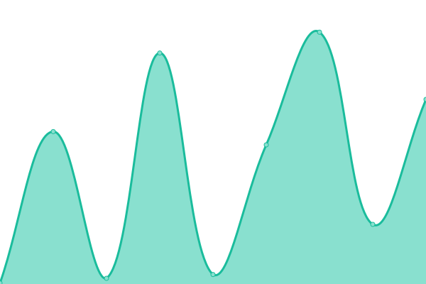
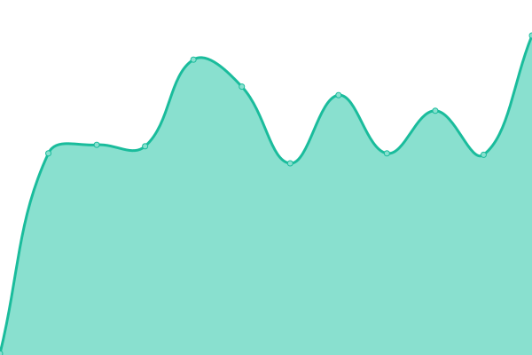

<h2 align="center">
  

❮ ZI ❯ [📈 Live Status](https://z-shell.github.io/status): <!--live status--> **🟧 Partial outage**

</h2>

This repository contains the open-source uptime monitor and status page for [Z-Sehll](https://github.com/z-shell).

Upptime uses [Issues](https://github.com/z-shell/status/issues) as incident reports, [Actions](https://github.com/z-shell/status/actions) as uptime monitors, and [Pages](https://status.zshell.dev) for the status page.

<!--start: status pages-->
<!-- This summary is generated by Upptime (https://github.com/upptime/upptime) -->
<!-- Do not edit this manually, your changes will be overwritten -->
<!-- prettier-ignore -->
| URL | Status | History | Response Time | Uptime |
| --- | ------ | ------- | ------------- | ------ |
|  [ZW Cloudflare (URL)](https://z-shell.pages.dev) | 🟩 Up | [zw-cloudflare-url.yml](https://github.com/z-shell/status/commits/HEAD/history/zw-cloudflare-url.yml) | 

 214ms
     
 | 

<a href="https://status.zshell.dev/history/zw-cloudflare-url">100.00%</a>
    

|  [ZI Source IPFS (URL)](https://zi-src.on.fleek.co) | 🟩 Up | [zi-source-ipfs-url.yml](https://github.com/z-shell/status/commits/HEAD/history/zi-source-ipfs-url.yml) | 

 795ms
     
 | 

<a href="https://status.zshell.dev/history/zi-source-ipfs-url">100.00%</a>
    

|  [ZI CDN (Asset URL)](https://cdn.digitalclouds.dev/fa/js/all.js) | 🟩 Up | [zi-cdn-asset-url.yml](https://github.com/z-shell/status/commits/HEAD/history/zi-cdn-asset-url.yml) | 

 161ms
     
 | 

<a href="https://status.zshell.dev/history/zi-cdn-asset-url">100.00%</a>
    

|  [Cloudlfare Pages (Redirect i-hub)](https://z-shell.pages.dev/i-hub) | 🟩 Up | [cloudlfare-pages-redirect-i-hub.yml](https://github.com/z-shell/status/commits/HEAD/history/cloudlfare-pages-redirect-i-hub.yml) | 

 300ms
     
 | 

<a href="https://status.zshell.dev/history/cloudlfare-pages-redirect-i-hub">100.00%</a>
    

|  [Cloudlfare Pages (Redirect i-lab)](https://z-shell.pages.dev/i-lab) | 🟩 Up | [cloudlfare-pages-redirect-i-lab.yml](https://github.com/z-shell/status/commits/HEAD/history/cloudlfare-pages-redirect-i-lab.yml) | 

 772ms
     
 | 

<a href="https://status.zshell.dev/history/cloudlfare-pages-redirect-i-lab">100.00%</a>
    

|  [Cloudlfare Pages (Redirect i-tee)](https://z-shell.pages.dev/i-tee) | 🟩 Up | [cloudlfare-pages-redirect-i-tee.yml](https://github.com/z-shell/status/commits/HEAD/history/cloudlfare-pages-redirect-i-tee.yml) | 

 1782ms
     
 | 

<a href="https://status.zshell.dev/history/cloudlfare-pages-redirect-i-tee">100.00%</a>
    

|  [Gitee (Ping SSH:22)](gitee.com) | 🟩 Up | [gitee-ping-ssh-22.yml](https://github.com/z-shell/status/commits/HEAD/history/gitee-ping-ssh-22.yml) | 

 239ms
     
 | 

<a href="https://status.zshell.dev/history/gitee-ping-ssh-22">100.00%</a>
    

|  [Gitee (RAW URL)](https://gitee.com/z-shell/zi-src/raw/main/lib/sh/install.sh) | 🟩 Up | [gitee-raw-url.yml](https://github.com/z-shell/status/commits/HEAD/history/gitee-raw-url.yml) | 

 289ms
     
 | 

<a href="https://status.zshell.dev/history/gitee-raw-url">100.00%</a>
    

|  [Github (Ping SSH:22)](github.com) | 🟩 Up | [github-ping-ssh-22.yml](https://github.com/z-shell/status/commits/HEAD/history/github-ping-ssh-22.yml) | 

 6ms
     
 | 

<a href="https://status.zshell.dev/history/github-ping-ssh-22">100.00%</a>
    

|  [GitHub (RAW URL)](https://raw.githubusercontent.com/z-shell/zi/main/docs/README.md) | 🟩 Up | [git-hub-raw-url.yml](https://github.com/z-shell/status/commits/HEAD/history/git-hub-raw-url.yml) | 

 67ms
     
 | 

<a href="https://status.zshell.dev/history/git-hub-raw-url">100.00%</a>
    

|  [GitLab (Ping SSH:22)](gitlab.com) | 🟩 Up | [git-lab-ping-ssh-22.yml](https://github.com/z-shell/status/commits/HEAD/history/git-lab-ping-ssh-22.yml) | 

 6ms
     
 | 

<a href="https://status.zshell.dev/history/git-lab-ping-ssh-22">100.00%</a>
    

|  [GitLab (RAW URL)](https://gitlab.com/ss-o/zi/-/raw/main/docs/README.md) | 🟩 Up | [git-lab-raw-url.yml](https://github.com/z-shell/status/commits/HEAD/history/git-lab-raw-url.yml) | 

 146ms
     
 | 

<a href="https://status.zshell.dev/history/git-lab-raw-url">100.00%</a>
    

|  [Cloudlfare (Ping DNS:TCP:53)](1.1.1.1) | 🟩 Up | [cloudlfare-ping-dns-tcp-53.yml](https://github.com/z-shell/status/commits/HEAD/history/cloudlfare-ping-dns-tcp-53.yml) | 

 7ms
     
 | 

<a href="https://status.zshell.dev/history/cloudlfare-ping-dns-tcp-53">100.00%</a>
    

|  [Cloudlfare (Ping DNS:UDP:53)](1.1.1.1) | 🟩 Up | [cloudlfare-ping-dns-udp-53.yml](https://github.com/z-shell/status/commits/HEAD/history/cloudlfare-ping-dns-udp-53.yml) | 

 61ms
     
 | 

<a href="https://status.zshell.dev/history/cloudlfare-ping-dns-udp-53">100.00%</a>
    

|  [Google (Ping DNS:TCP:53)](8.8.8.8) | 🟩 Up | [google-ping-dns-tcp-53.yml](https://github.com/z-shell/status/commits/HEAD/history/google-ping-dns-tcp-53.yml) | 

 7ms
     
 | 

<a href="https://status.zshell.dev/history/google-ping-dns-tcp-53">100.00%</a>
    

|  [Crowdin (URL)](https://crowdin.digitalclouds.dev) | 🟥 Down | [crowdin-url.yml](https://github.com/z-shell/status/commits/HEAD/history/crowdin-url.yml) | 

 141ms
     
 | 

<a href="https://status.zshell.dev/history/crowdin-url">16.07%</a>
    

<!--end: status pages-->

[**Visit our status website →**](https://status.zshell.dev)

## 📄 License

- Project: [ZI](https://github.com/z-shell/zi)
- Code: [MIT](./LICENSE) © [Z-Shell](https://github.com/z-shell)
- Data in the `./history` directory: [Open Database License](https://opendatacommons.org/licenses/odbl/1-0/)
