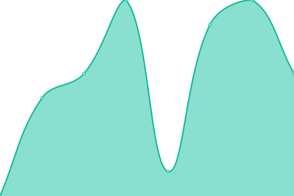

<h2 align="center">
  
  
  ❮ ZI ❯ [📈 Live Status](https://z-shell.github.io/status): <!--live status--> **🟩 All systems operational**

</h2>

This repository contains the open-source uptime monitor and status page for [Z-Sehll ZI](https://github.com/z-shell), powered by [Upptime](https://github.com/upptime/upptime).

Upptime uses [Issues](https://github.com/z-shell/uptime-status/issues) as incident reports, [Actions](https://github.com/z-shell/uptime-status/actions) as uptime monitors, and [Pages](https://z-shell.github.io/uptime-status) for the status page.

<!--start: status pages-->
<!-- This summary is generated by Upptime (https://github.com/upptime/upptime) -->
<!-- Do not edit this manually, your changes will be overwritten -->
<!-- prettier-ignore -->
| URL | Status | History | Response Time | Uptime |
| --- | ------ | ------- | ------------- | ------ |
|  [ZI Cloudflare](https://z-shell.pages.dev) | 🟩 Up | [zi-cloudflare.yml](https://github.com/z-shell/status/commits/HEAD/history/zi-cloudflare.yml) | 

 326ms
     
 | 

<a href="https://z-shell.github.io/status/history/zi-cloudflare">99.77%</a>
    

|  [ZI CDN](https://space.ss-o.workers.dev) | 🟩 Up | [zi-cdn.yml](https://github.com/z-shell/status/commits/HEAD/history/zi-cdn.yml) | 

 224ms
     
 | 

<a href="https://z-shell.github.io/status/history/zi-cdn">100.00%</a>
    

|  [Cloudlfare Redirect 1](https://z-shell.pages.dev/i-hub) | 🟩 Up | [cloudlfare-redirect-1.yml](https://github.com/z-shell/status/commits/HEAD/history/cloudlfare-redirect-1.yml) | 

 225ms
     
 | 

<a href="https://z-shell.github.io/status/history/cloudlfare-redirect-1">99.77%</a>
    

|  [Cloudlfare Redirect 2](https://z-shell.pages.dev/i-lab) | 🟩 Up | [cloudlfare-redirect-2.yml](https://github.com/z-shell/status/commits/HEAD/history/cloudlfare-redirect-2.yml) | 

 298ms
     
 | 

<a href="https://z-shell.github.io/status/history/cloudlfare-redirect-2">99.77%</a>
    

|  [Git.io Redirect](https://git.io/get-zi) | 🟩 Up | [git-io-redirect.yml](https://github.com/z-shell/status/commits/HEAD/history/git-io-redirect.yml) | 

 224ms
     
 | 

<a href="https://z-shell.github.io/status/history/git-io-redirect">100.00%</a>
    

|  [Github (SSH)](github.com) | 🟩 Up | [github-ssh.yml](https://github.com/z-shell/status/commits/HEAD/history/github-ssh.yml) | 

 20ms
     
 | 

<a href="https://z-shell.github.io/status/history/github-ssh">100.00%</a>
    

|  [GitHub (RAW)](https://raw.githubusercontent.com/z-shell/zi/main/docs/README.md) | 🟩 Up | [git-hub-raw.yml](https://github.com/z-shell/status/commits/HEAD/history/git-hub-raw.yml) | 

 117ms
     
 | 

<a href="https://z-shell.github.io/status/history/git-hub-raw">100.00%</a>
    

|  [GitLab (SSH)](gitlab.com) | 🟩 Up | [git-lab-ssh.yml](https://github.com/z-shell/status/commits/HEAD/history/git-lab-ssh.yml) | 

 5ms
     
 | 

<a href="https://z-shell.github.io/status/history/git-lab-ssh">100.00%</a>
    

|  [GitLab (RAW)](https://gitlab.com/ss-o/zi/-/raw/main/docs/README.md) | 🟩 Up | [git-lab-raw.yml](https://github.com/z-shell/status/commits/HEAD/history/git-lab-raw.yml) | 

 183ms
     
 | 

<a href="https://z-shell.github.io/status/history/git-lab-raw">100.00%</a>
    

|  [Cloudlfare DNS](1.1.1.1) | 🟩 Up | [cloudlfare-dns.yml](https://github.com/z-shell/status/commits/HEAD/history/cloudlfare-dns.yml) | 

 5ms
     
 | 

<a href="https://z-shell.github.io/status/history/cloudlfare-dns">100.00%</a>
    

|  [Google DNS](8.8.8.8) | 🟩 Up | [google-dns.yml](https://github.com/z-shell/status/commits/HEAD/history/google-dns.yml) | 

 5ms
     
 | 

<a href="https://z-shell.github.io/status/history/google-dns">100.00%</a>
    

<!--end: status pages-->

[**Visit our status website →**](https://z-shell.github.io/uptime-status)

## 📄 License

- Powered by: [Upptime](https://github.com/upptime/upptime)
- Code: [MIT](./LICENSE) © [Z-Shell ZI](https://z-shell.github.io/uptime-status)
- Data in the `./history` directory: [Open Database License](https://opendatacommons.org/licenses/odbl/1-0/)
