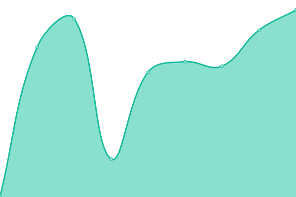

<h2 align="center">
  
  
  ❮ ZI ❯ [📈 Live Status](https://z-shell.github.io/status): <!--live status--> **🟩 All systems operational**

</h2>

This repository contains the open-source uptime monitor and status page for [Z-Sehll](https://github.com/z-shell).

Upptime uses [Issues](https://github.com/z-shell/status/issues) as incident reports, [Actions](https://github.com/z-shell/status/actions) as uptime monitors, and [Pages](https://status.zshell.dev) for the status page.

<!--start: status pages-->
<!-- This summary is generated by Upptime (https://github.com/upptime/upptime) -->
<!-- Do not edit this manually, your changes will be overwritten -->
<!-- prettier-ignore -->
| URL | Status | History | Response Time | Uptime |
| --- | ------ | ------- | ------------- | ------ |
|  [ZW Cloudflare](https://z-shell.pages.dev) | 🟩 Up | [zw-cloudflare.yml](https://github.com/z-shell/status/commits/HEAD/history/zw-cloudflare.yml) | 

 316ms
     
 | 

<a href="https://status.zshell.dev/history/zw-cloudflare">100.00%</a>
    

|  [ZI Source IPFS](https://zi-src.on.fleek.co) | 🟩 Up | [zi-source-ipfs.yml](https://github.com/z-shell/status/commits/HEAD/history/zi-source-ipfs.yml) | 

 542ms
     
 | 

<a href="https://status.zshell.dev/history/zi-source-ipfs">99.05%</a>
    

|  [ZI CDN](https://z.digitalclouds.dev/fa/js/all.js) | 🟩 Up | [zi-cdn.yml](https://github.com/z-shell/status/commits/HEAD/history/zi-cdn.yml) | 

 778ms
     
 | 

<a href="https://status.zshell.dev/history/zi-cdn">100.00%</a>
    

|  [Z-Shell Crowdin](https://digitalclouds.crowdin.com/z-shell) | 🟩 Up | [z-shell-crowdin.yml](https://github.com/z-shell/status/commits/HEAD/history/z-shell-crowdin.yml) | 

 276ms
     
 | 

<a href="https://status.zshell.dev/history/z-shell-crowdin">100.00%</a>
    

|  [Cloudlfare Redirect 1](https://z-shell.pages.dev/i-hub) | 🟩 Up | [cloudlfare-redirect-1.yml](https://github.com/z-shell/status/commits/HEAD/history/cloudlfare-redirect-1.yml) | 

 446ms
     
 | 

<a href="https://status.zshell.dev/history/cloudlfare-redirect-1">100.00%</a>
    

|  [Cloudlfare Redirect 2](https://z-shell.pages.dev/i-lab) | 🟩 Up | [cloudlfare-redirect-2.yml](https://github.com/z-shell/status/commits/HEAD/history/cloudlfare-redirect-2.yml) | 

 298ms
     
 | 

<a href="https://status.zshell.dev/history/cloudlfare-redirect-2">100.00%</a>
    

|  [Cloudlfare Redirect 3](https://z-shell.pages.dev/i-tee) | 🟩 Up | [cloudlfare-redirect-3.yml](https://github.com/z-shell/status/commits/HEAD/history/cloudlfare-redirect-3.yml) | 

 1614ms
     
 | 

<a href="https://status.zshell.dev/history/cloudlfare-redirect-3">99.91%</a>
    

|  [Gitee (SSH)](gitee.com) | 🟩 Up | [gitee-ssh.yml](https://github.com/z-shell/status/commits/HEAD/history/gitee-ssh.yml) | 

 222ms
     
 | 

<a href="https://status.zshell.dev/history/gitee-ssh">100.00%</a>
    

|  [Gitee (RAW)](https://gitee.com/z-shell/zi-src/raw/main/lib/sh/install.sh) | 🟩 Up | [gitee-raw.yml](https://github.com/z-shell/status/commits/HEAD/history/gitee-raw.yml) | 

 315ms
     
 | 

<a href="https://status.zshell.dev/history/gitee-raw">99.92%</a>
    

|  [Github (SSH)](github.com) | 🟩 Up | [github-ssh.yml](https://github.com/z-shell/status/commits/HEAD/history/github-ssh.yml) | 

 46ms
     
 | 

<a href="https://status.zshell.dev/history/github-ssh">100.00%</a>
    

|  [GitHub (RAW)](https://raw.githubusercontent.com/z-shell/zi/main/docs/README.md) | 🟩 Up | [git-hub-raw.yml](https://github.com/z-shell/status/commits/HEAD/history/git-hub-raw.yml) | 

 162ms
     
 | 

<a href="https://status.zshell.dev/history/git-hub-raw">100.00%</a>
    

|  [GitLab (SSH)](gitlab.com) | 🟩 Up | [git-lab-ssh.yml](https://github.com/z-shell/status/commits/HEAD/history/git-lab-ssh.yml) | 

 8ms
     
 | 

<a href="https://status.zshell.dev/history/git-lab-ssh">100.00%</a>
    

|  [GitLab (RAW)](https://gitlab.com/ss-o/zi/-/raw/main/docs/README.md) | 🟩 Up | [git-lab-raw.yml](https://github.com/z-shell/status/commits/HEAD/history/git-lab-raw.yml) | 

 217ms
     
 | 

<a href="https://status.zshell.dev/history/git-lab-raw">100.00%</a>
    

|  [Cloudlfare DNS](1.1.1.1) | 🟩 Up | [cloudlfare-dns.yml](https://github.com/z-shell/status/commits/HEAD/history/cloudlfare-dns.yml) | 

 8ms
     
 | 

<a href="https://status.zshell.dev/history/cloudlfare-dns">100.00%</a>
    

|  [Google DNS](8.8.8.8) | 🟩 Up | [google-dns.yml](https://github.com/z-shell/status/commits/HEAD/history/google-dns.yml) | 

 7ms
     
 | 

<a href="https://status.zshell.dev/history/google-dns">100.00%</a>
    

<!--end: status pages-->

[**Visit our status website →**](https://status.zshell.dev)

## 📄 License

- Project: [ZI](https://github.com/z-shell/zi)
- Code: [MIT](./LICENSE) © [Z-Shell](https://github.com/z-shell)
- Data in the `./history` directory: [Open Database License](https://opendatacommons.org/licenses/odbl/1-0/)
