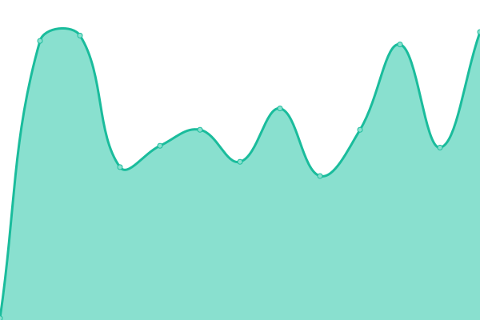
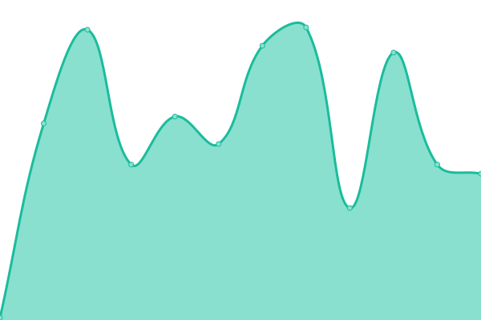
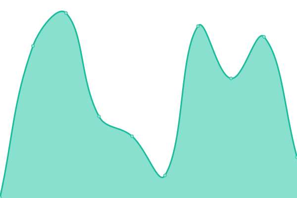
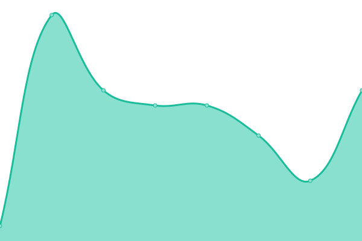
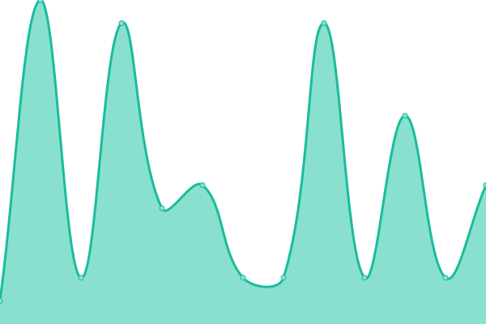

  <h1>
     ❮ ZI ❯ </h1>
<h2>

[📈 Live Status](https://z-shell.github.io/status): <!--live status--> **🟩 All systems operational**

</h2>

This repository contains the open-source uptime monitor and status page for [Z-Sehll](https://github.com/z-shell).

Upptime uses [Issues](https://github.com/z-shell/status/issues) as incident reports, [Actions](https://github.com/z-shell/status/actions) as uptime monitors, and [Pages](https://status.zshell.dev) for the status page.

<!--start: status pages-->
<!-- This summary is generated by Upptime (https://github.com/upptime/upptime) -->
<!-- Do not edit this manually, your changes will be overwritten -->
<!-- prettier-ignore -->
| URL | Status | History | Response Time | Uptime |
| --- | ------ | ------- | ------------- | ------ |
|  [wiki.zshell.dev](https://wiki.zshell.dev/r2/fa/js/all.js) | 🟩 Up | [wiki-zshell-dev.yml](https://github.com/z-shell/status/commits/HEAD/history/wiki-zshell-dev.yml) | 

 618ms
     
 | 

<a href="https://status.zshell.dev/history/wiki-zshell-dev">99.20%</a>
    

|  [raw.zshell.dev](https://raw.zshell.dev/sh/install.sh) | 🟩 Up | [raw-zshell-dev.yml](https://github.com/z-shell/status/commits/HEAD/history/raw-zshell-dev.yml) | 

 326ms
     
 | 

<a href="https://status.zshell.dev/history/raw-zshell-dev">100.00%</a>
    

|  [ipfs.zshell.dev](https://ipfs.zshell.dev/sh/install.sh) | 🟩 Up | [ipfs-zshell-dev.yml](https://github.com/z-shell/status/commits/HEAD/history/ipfs-zshell-dev.yml) | 

 1320ms
     
 | 

<a href="https://status.zshell.dev/history/ipfs-zshell-dev">98.53%</a>
    

|  [init.zshell.dev](https://init.zshell.dev) | 🟩 Up | [init-zshell-dev.yml](https://github.com/z-shell/status/commits/HEAD/history/init-zshell-dev.yml) | 

 307ms
     
 | 

<a href="https://status.zshell.dev/history/init-zshell-dev">100.00%</a>
    

|  [get.zshell.dev](https://get.zshell.dev) | 🟩 Up | [get-zshell-dev.yml](https://github.com/z-shell/status/commits/HEAD/history/get-zshell-dev.yml) | 

 250ms
     
 | 

<a href="https://status.zshell.dev/history/get-zshell-dev">100.00%</a>
    

|  [git.io/get-zi](https://git.io/get-zi) | 🟩 Up | [git-io-get-zi.yml](https://github.com/z-shell/status/commits/HEAD/history/git-io-get-zi.yml) | 

 147ms
     
 | 

<a href="https://status.zshell.dev/history/git-io-get-zi">100.00%</a>
    

|  [git.io/zi-loader](https://git.io/zi-loader) | 🟩 Up | [git-io-zi-loader.yml](https://github.com/z-shell/status/commits/HEAD/history/git-io-zi-loader.yml) | 

 47ms
     
 | 

<a href="https://status.zshell.dev/history/git-io-zi-loader">100.00%</a>
    

|  [RAW github.com](https://raw.githubusercontent.com/z-shell/zi/main/docs/README.md) | 🟩 Up | [raw-github-com.yml](https://github.com/z-shell/status/commits/HEAD/history/raw-github-com.yml) | 

 133ms
     
 | 

<a href="https://status.zshell.dev/history/raw-github-com">100.00%</a>
    

|  [RAW gitlab.com](https://gitlab.com/ss-o/zi/-/raw/main/docs/README.md) | 🟩 Up | [raw-gitlab-com.yml](https://github.com/z-shell/status/commits/HEAD/history/raw-gitlab-com.yml) | 

 202ms
     
 | 

<a href="https://status.zshell.dev/history/raw-gitlab-com">100.00%</a>
    

|  [1.1.1.1:53](1.1.1.1) | 🟩 Up | [1-1-1-1-53.yml](https://github.com/z-shell/status/commits/HEAD/history/1-1-1-1-53.yml) | 

 6ms
     
 | 

<a href="https://status.zshell.dev/history/1-1-1-1-53">100.00%</a>
    

|  [8.8.8.8:53](8.8.8.8) | 🟩 Up | [8-8-8-8-53.yml](https://github.com/z-shell/status/commits/HEAD/history/8-8-8-8-53.yml) | 

 5ms
     
 | 

<a href="https://status.zshell.dev/history/8-8-8-8-53">100.00%</a>
    

|  [crowdin.com/z-shell](https://digitalclouds.crowdin.com/z-shell) | 🟩 Up | [crowdin-com-z-shell.yml](https://github.com/z-shell/status/commits/HEAD/history/crowdin-com-z-shell.yml) | 

 255ms
     
 | 

<a href="https://status.zshell.dev/history/crowdin-com-z-shell">100.00%</a>
    

<!--end: status pages-->

  
  [**Visit our status website →**](https://status.zshell.dev)

## 📄 License

- Project: [ZI](https://github.com/z-shell/zi)
- Code: [MIT](./LICENSE) © [Z-Shell](https://github.com/z-shell)
- Data in the `./history` directory: [Open Database License](https://opendatacommons.org/licenses/odbl/1-0/)
