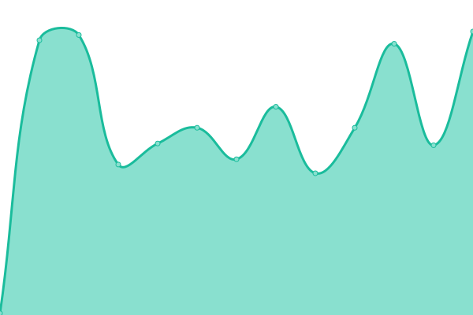
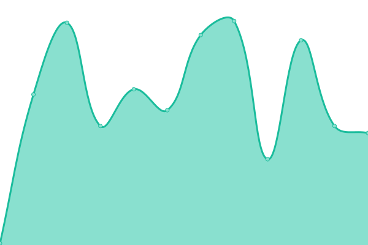

<h1 align="center">
  
 ❮ Zi ❯ 

</h1>
<h2 align="center">

[📈 Live Status](https://status.zshell.dev): <!--live status--> **🟥 Complete outage**

</h2>

This repository contains the open-source uptime monitor and status page for [Z-Shell](https://github.com/z-shell).

Upptime uses [Issues](https://github.com/z-shell/status/issues) as incident reports, [Actions](https://github.com/z-shell/status/actions) as uptime monitors, and [Pages](https://status.zshell.dev) for the status page.

<!--start: status pages-->
<!-- This summary is generated by Upptime (https://github.com/upptime/upptime) -->
<!-- Do not edit this manually, your changes will be overwritten -->
<!-- prettier-ignore -->
| URL | Status | History | Response Time | Uptime |
| --- | ------ | ------- | ------------- | ------ |
|  [wiki.zshell.dev](https://wiki.zshell.dev) | 🟥 Down | [wiki-zshell-dev.yml](https://github.com/z-shell/status/commits/HEAD/history/wiki-zshell-dev.yml) | 

 419ms
     
 | 

<a href="https://status.zshell.dev/history/wiki-zshell-dev">100.00%</a>
    

|  [r2.zshell.dev](https://r2.zshell.dev/src/zsh/init.zsh) | 🟥 Down | [r2-zshell-dev.yml](https://github.com/z-shell/status/commits/HEAD/history/r2-zshell-dev.yml) | 

 352ms
     
 | 

<a href="https://status.zshell.dev/history/r2-zshell-dev">100.00%</a>
    

|  [src.zshell.dev](https://src.zshell.dev/zsh/init.zsh) | 🟥 Down | [src-zshell-dev.yml](https://github.com/z-shell/status/commits/HEAD/history/src-zshell-dev.yml) | 

 280ms
     
 | 

<a href="https://status.zshell.dev/history/src-zshell-dev">100.00%</a>
    

|  [init.zshell.dev](https://init.zshell.dev) | 🟥 Down | [init-zshell-dev.yml](https://github.com/z-shell/status/commits/HEAD/history/init-zshell-dev.yml) | 

 292ms
     
 | 

<a href="https://status.zshell.dev/history/init-zshell-dev">100.00%</a>
    

|  [get.zshell.dev](https://get.zshell.dev) | 🟥 Down | [get-zshell-dev.yml](https://github.com/z-shell/status/commits/HEAD/history/get-zshell-dev.yml) | 

 302ms
     
 | 

<a href="https://status.zshell.dev/history/get-zshell-dev">100.00%</a>
    

|  [translate.zshell.dev](https://translate.zshell.dev) | 🟥 Down | [translate-zshell-dev.yml](https://github.com/z-shell/status/commits/HEAD/history/translate-zshell-dev.yml) | 

 578ms
     
 | 

<a href="https://status.zshell.dev/history/translate-zshell-dev">99.46%</a>
    

<!--end: status pages-->

<!-- start: YOUR_STARTER --><!-- end: YOUR_STARTER -->

[**Visit our status website →**](https://status.zshell.dev)

## 📄 License

- Code: [MIT](./LICENSE) © [Z-Shell](https://github.com/z-shell)
- Data in the `./history` directory: [Open Database License](https://opendatacommons.org/licenses/odbl/1-0/)
