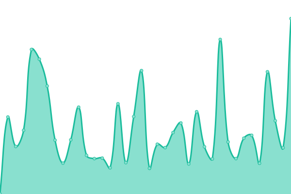

<h1 align="center">
  
 ⮠Zi ⯠

</h1>
<h2 align="center">

[📈 Live Status](https://z-shell.github.io/status): <!--live status--> **🟩 All systems operational**

</h2>

This repository contains the open-source uptime monitor and status page for [Z-Sehll](https://github.com/z-shell).

Upptime uses [Issues](https://github.com/z-shell/status/issues) as incident reports, [Actions](https://github.com/z-shell/status/actions) as uptime monitors, and [Pages](https://status.zshell.dev) for the status page.

<!--start: status pages-->
<!-- This summary is generated by Upptime (https://github.com/upptime/upptime) -->
<!-- Do not edit this manually, your changes will be overwritten -->
<!-- prettier-ignore -->
| URL | Status | History | Response Time | Uptime |
| --- | ------ | ------- | ------------- | ------ |
|  [wiki.zshell.dev](https://wiki.zshell.dev) | 🟩 Up | [wiki-zshell-dev.yml](https://github.com/z-shell/status/commits/HEAD/history/wiki-zshell-dev.yml) | 

 209ms
     
 | 

<a href="https://status.zshell.dev/history/wiki-zshell-dev">100.00%</a>
    

|  [r2.zshell.dev](https://r2.zshell.dev/src/zsh/init.zsh) | 🟩 Up | [r2-zshell-dev.yml](https://github.com/z-shell/status/commits/HEAD/history/r2-zshell-dev.yml) | 

 476ms
     
 | 

<a href="https://status.zshell.dev/history/r2-zshell-dev">100.00%</a>
    

|  [src.zshell.dev](https://src.zshell.dev/zsh/init.zsh) | 🟩 Up | [src-zshell-dev.yml](https://github.com/z-shell/status/commits/HEAD/history/src-zshell-dev.yml) | 

 148ms
     
 | 

<a href="https://status.zshell.dev/history/src-zshell-dev">100.00%</a>
    

|  [init.zshell.dev](https://init.zshell.dev) | 🟩 Up | [init-zshell-dev.yml](https://github.com/z-shell/status/commits/HEAD/history/init-zshell-dev.yml) | 

 170ms
     
 | 

<a href="https://status.zshell.dev/history/init-zshell-dev">100.00%</a>
    

|  [get.zshell.dev](https://get.zshell.dev) | 🟩 Up | [get-zshell-dev.yml](https://github.com/z-shell/status/commits/HEAD/history/get-zshell-dev.yml) | 

 151ms
     
 | 

<a href="https://status.zshell.dev/history/get-zshell-dev">100.00%</a>
    

|  [git.io/zi-loader](https://git.io/zi-loader) | 🟩 Up | [git-io-zi-loader.yml](https://github.com/z-shell/status/commits/HEAD/history/git-io-zi-loader.yml) | 

 161ms
     
 | 

<a href="https://status.zshell.dev/history/git-io-zi-loader">100.00%</a>
    

|  [git.io/get-zi](https://git.io/get-zi) | 🟩 Up | [git-io-get-zi.yml](https://github.com/z-shell/status/commits/HEAD/history/git-io-get-zi.yml) | 

 52ms
     
 | 

<a href="https://status.zshell.dev/history/git-io-get-zi">100.00%</a>
    

|  [RAW github.com](https://raw.githubusercontent.com/z-shell/zi/main/docs/README.md) | 🟩 Up | [raw-github-com.yml](https://github.com/z-shell/status/commits/HEAD/history/raw-github-com.yml) | 

 115ms
     
 | 

<a href="https://status.zshell.dev/history/raw-github-com">100.00%</a>
    

|  [RAW gitlab.com](https://gitlab.com/ss-o/zi/-/raw/main/docs/README.md) | 🟩 Up | [raw-gitlab-com.yml](https://github.com/z-shell/status/commits/HEAD/history/raw-gitlab-com.yml) | 

 249ms
     
 | 

<a href="https://status.zshell.dev/history/raw-gitlab-com">100.00%</a>
    

|  [Google DNS-over-TLS](https://dns.google) | 🟩 Up | [google-dns-over-tls.yml](https://github.com/z-shell/status/commits/HEAD/history/google-dns-over-tls.yml) | 

 159ms
     
 | 

<a href="https://status.zshell.dev/history/google-dns-over-tls">100.00%</a>
    

|  [Cloudflare DNS-over-TLS](https://cloudflare-dns.com) | 🟩 Up | [cloudflare-dns-over-tls.yml](https://github.com/z-shell/status/commits/HEAD/history/cloudflare-dns-over-tls.yml) | 

 114ms
     
 | 

<a href="https://status.zshell.dev/history/cloudflare-dns-over-tls">100.00%</a>
    

|  [translate.zshell.dev](https://translate.zshell.dev) | 🟩 Up | [translate-zshell-dev.yml](https://github.com/z-shell/status/commits/HEAD/history/translate-zshell-dev.yml) | 

 525ms
     
 | 

<a href="https://status.zshell.dev/history/translate-zshell-dev">100.00%</a>
    

<!--end: status pages-->

<!-- start: YOUR_STARTER --><!-- end: YOUR_STARTER -->

  
  [**Visit our status website →**](https://status.zshell.dev)

## 📄 License

- Code: [MIT](./LICENSE) © [Z-Shell](https://github.com/z-shell)
- Data in the `./history` directory: [Open Database License](https://opendatacommons.org/licenses/odbl/1-0/)
