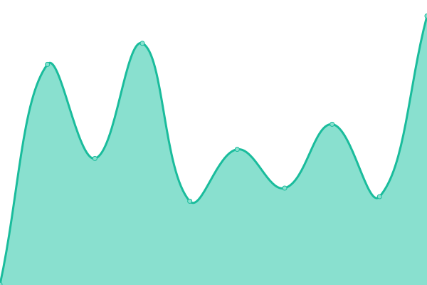
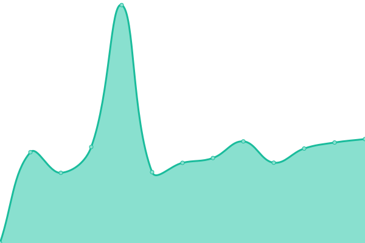
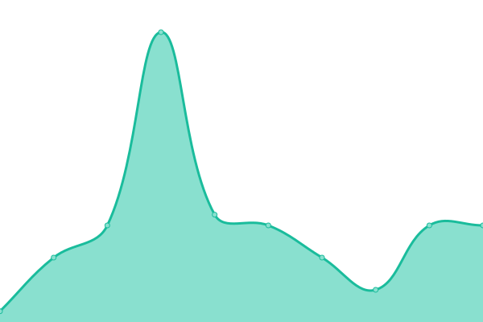
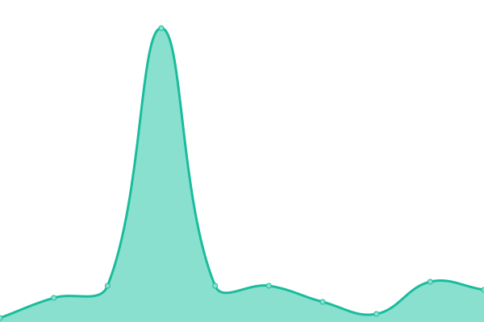

<h2 align="center">
  

❮ ZI ❯ [📈 Live Status](https://z-shell.github.io/status): <!--live status--> **🟩 All systems operational**

</h2>

This repository contains the open-source uptime monitor and status page for [Z-Sehll](https://github.com/z-shell).

Upptime uses [Issues](https://github.com/z-shell/status/issues) as incident reports, [Actions](https://github.com/z-shell/status/actions) as uptime monitors, and [Pages](https://status.zshell.dev) for the status page.

<!--start: status pages-->
<!-- This summary is generated by Upptime (https://github.com/upptime/upptime) -->
<!-- Do not edit this manually, your changes will be overwritten -->
<!-- prettier-ignore -->
| URL | Status | History | Response Time | Uptime |
| --- | ------ | ------- | ------------- | ------ |
|  [ZI Wiki [URL]](https://z-shell.pages.dev) | 🟩 Up | [zi-wiki-url.yml](https://github.com/z-shell/status/commits/HEAD/history/zi-wiki-url.yml) | 

 242ms
     
 | 

<a href="https://status.zshell.dev/history/zi-wiki-url">100.00%</a>
    

|  [ZI Source IPFS [URL]](https://zi-src.on.fleek.co) | 🟩 Up | [zi-source-ipfs-url.yml](https://github.com/z-shell/status/commits/HEAD/history/zi-source-ipfs-url.yml) | 

 445ms
     
 | 

<a href="https://status.zshell.dev/history/zi-source-ipfs-url">100.00%</a>
    

|  [ZI Content Delivery [URL]](https://cdn.digitalclouds.dev/fa/js/all.js) | 🟩 Up | [zi-content-delivery-url.yml](https://github.com/z-shell/status/commits/HEAD/history/zi-content-delivery-url.yml) | 

 206ms
     
 | 

<a href="https://status.zshell.dev/history/zi-content-delivery-url">100.00%</a>
    

|  [Git.io get-zi [STATUS]](https://git.io/get-zi) | 🟩 Up | [git-io-get-zi-status.yml](https://github.com/z-shell/status/commits/HEAD/history/git-io-get-zi-status.yml) | 

 342ms
     
 | 

<a href="https://status.zshell.dev/history/git-io-get-zi-status">100.00%</a>
    

|  [Git.io zi-loader [STATUS]](https://git.io/zi-loader) | 🟩 Up | [git-io-zi-loader-status.yml](https://github.com/z-shell/status/commits/HEAD/history/git-io-zi-loader-status.yml) | 

 178ms
     
 | 

<a href="https://status.zshell.dev/history/git-io-zi-loader-status">100.00%</a>
    

|  [Redirect i-hub [URL]](https://z-shell.pages.dev/i-hub) | 🟩 Up | [redirect-i-hub-url.yml](https://github.com/z-shell/status/commits/HEAD/history/redirect-i-hub-url.yml) | 

 349ms
     
 | 

<a href="https://status.zshell.dev/history/redirect-i-hub-url">100.00%</a>
    

|  [Redirect i-lab [URL]](https://z-shell.pages.dev/i-lab) | 🟩 Up | [redirect-i-lab-url.yml](https://github.com/z-shell/status/commits/HEAD/history/redirect-i-lab-url.yml) | 

 275ms
     
 | 

<a href="https://status.zshell.dev/history/redirect-i-lab-url">100.00%</a>
    

|  [Redirect i-tee [URL]](https://z-shell.pages.dev/i-tee) | 🟩 Up | [redirect-i-tee-url.yml](https://github.com/z-shell/status/commits/HEAD/history/redirect-i-tee-url.yml) | 

 1716ms
     
 | 

<a href="https://status.zshell.dev/history/redirect-i-tee-url">0.00%</a>
    

|  [Gitee SSH [TCP 22]](gitee.com) | 🟩 Up | [gitee-ssh-tcp-22.yml](https://github.com/z-shell/status/commits/HEAD/history/gitee-ssh-tcp-22.yml) | 

 194ms
     
 | 

<a href="https://status.zshell.dev/history/gitee-ssh-tcp-22">100.00%</a>
    

|  [Gitee RAW [URL]](https://gitee.com/z-shell/zi-src/raw/main/lib/sh/install.sh) | 🟩 Up | [gitee-raw-url.yml](https://github.com/z-shell/status/commits/HEAD/history/gitee-raw-url.yml) | 

 323ms
     
 | 

<a href="https://status.zshell.dev/history/gitee-raw-url">0.00%</a>
    

|  [Github SSH [TCP 22]](github.com) | 🟩 Up | [github-ssh-tcp-22.yml](https://github.com/z-shell/status/commits/HEAD/history/github-ssh-tcp-22.yml) | 

 26ms
     
 | 

<a href="https://status.zshell.dev/history/github-ssh-tcp-22">100.00%</a>
    

|  [GitHub RAW [URL]](https://raw.githubusercontent.com/z-shell/zi/main/docs/README.md) | 🟩 Up | [git-hub-raw-url.yml](https://github.com/z-shell/status/commits/HEAD/history/git-hub-raw-url.yml) | 

 100ms
     
 | 

<a href="https://status.zshell.dev/history/git-hub-raw-url">100.00%</a>
    

|  [GitLab SSH [TCP 22]](gitlab.com) | 🟩 Up | [git-lab-ssh-tcp-22.yml](https://github.com/z-shell/status/commits/HEAD/history/git-lab-ssh-tcp-22.yml) | 

 4ms
     
 | 

<a href="https://status.zshell.dev/history/git-lab-ssh-tcp-22">100.00%</a>
    

|  [GitLab RAW [URL]](https://gitlab.com/ss-o/zi/-/raw/main/docs/README.md) | 🟩 Up | [git-lab-raw-url.yml](https://github.com/z-shell/status/commits/HEAD/history/git-lab-raw-url.yml) | 

 300ms
     
 | 

<a href="https://status.zshell.dev/history/git-lab-raw-url">100.00%</a>
    

|  [Cloudlfare DNS [TCP 53]](1.1.1.1) | 🟩 Up | [cloudlfare-dns-tcp-53.yml](https://github.com/z-shell/status/commits/HEAD/history/cloudlfare-dns-tcp-53.yml) | 

 4ms
     
 | 

<a href="https://status.zshell.dev/history/cloudlfare-dns-tcp-53">100.00%</a>
    

|  [Google DNS [TCP 53]](8.8.8.8) | 🟩 Up | [google-dns-tcp-53.yml](https://github.com/z-shell/status/commits/HEAD/history/google-dns-tcp-53.yml) | 

 4ms
     
 | 

<a href="https://status.zshell.dev/history/google-dns-tcp-53">100.00%</a>
    

|  [Crowdin [STATUS]](https://crowdin.digitalclouds.dev/z-shell) | 🟩 Up | [crowdin-status.yml](https://github.com/z-shell/status/commits/HEAD/history/crowdin-status.yml) | 

 99ms
     
 | 

<a href="https://status.zshell.dev/history/crowdin-status">100.00%</a>
    

<!--end: status pages-->

[**Visit our status website →**](https://status.zshell.dev)

## 📄 License

- Project: [ZI](https://github.com/z-shell/zi)
- Code: [MIT](./LICENSE) © [Z-Shell](https://github.com/z-shell)
- Data in the `./history` directory: [Open Database License](https://opendatacommons.org/licenses/odbl/1-0/)
